# Mobile Setup

Device : [POCO X3 Pro](https://www.gsmarena.com/xiaomi_poco_x3_pro-10802.php) 
CodeName : Vayu 
Variant : 6/128 
Recovery : [TWRP](https://eu.dl.twrp.me/vayu/twrp-3.7.0_12-0-vayu.img.html) 
Firmware : [v13.0.9.0.SJUMIXM](https://xiaomifirmwareupdater.com/firmware/vayu/stable/V13.0.9.0.SJUMIXM/) 
OS : lineage-19.1-20231105 ([Mirror 1](https://lineage-archive.timschumi.net/build/14772) , [Mirror 2](https://drive.google.com/file/d/18c-ezNr0LoxXy3CNQQxY62XLaoL5QYsI/view?usp=sharing)) 
Kernel : [perf by chiteroman](https://github.com/chiteroman/vayu_kernel_lineage/releases) 
Gapps : [NikGApps SL - Core](https://sourceforge.net/projects/nikgapps/files/Releases/NikGapps-SL/) 

Gpu Version : Stock (v@0502) 
Browser : [Kiwi](https://play.google.com/store/apps/details?id=com.kiwibrowser.browser) 
Dns : [ControlD](https://controld.com/free-dns) 
Ringtone : [Kudüs Fatihi Selahaddin Eyyubi](https://github.com/ToucH9000/Mobile-Setup/raw/main/Files/O_Kutlu_Zaferin.zip)

Camera : [MGC_8.1.101_A9_GV2b_snap](https://1-dontsharethislink.celsoazevedo.com/file/filesc/MGC_8.1.101_A9_GV2b_snap.apk) 
Config : [ForkBSGx3P-NFv61](https://github.com/BEASTover9000/Mobile-Specification/releases/tag/v61) 

# KernelSU Setup

**KernelSU is best**

  <title>test</title>
  
How?

  
1. Module system based on [OverlayFS](https://en.m.wikipedia.org/wiki/OverlayFS)
2. Lock up the root power in a cage through [App Profile](https://kernelsu.org/guide/app-profile.html)

[Zygisk Next](https://github.com/Dr-TSNG/ZygiskNext/releases) + [Shamiko](https://github.com/LSPosed/LSPosed.github.io/releases) + [HIDEpropLOS](https://github.com/ToucH9000/Mobile-Setup/raw/main/Files/HIDEpropLOS.zip) + [LSPosed (No Log)](https://github.com/amrelhossieny/LSPosed-MOD/releases)

# Detections

**Some detections are common and can't be bypassed, this doesn't mean you can polute the modding environment by crying to a developer to [fix](https://github.com/ToucH9000/PIFvayuLOS/blob/main/Details.md) detection.** [Here's](https://github.com/ToucH9000/Mobile-Setup/blob/main/Files/build.prop) the example of hiding LineageOS properties which is present in system partion (build.prop)

  
Spic

 

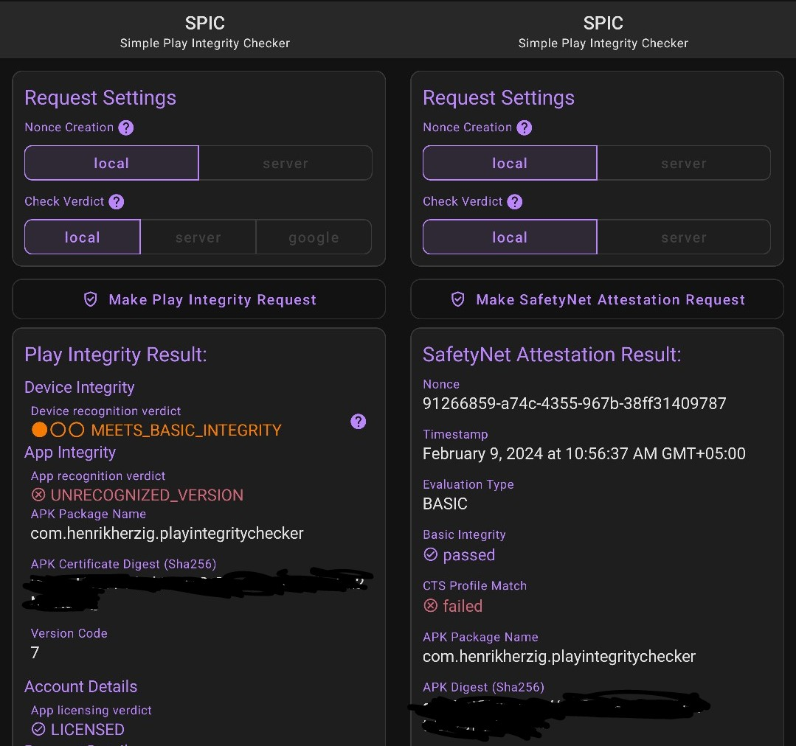

  
Ruru

 

  
Momo

 

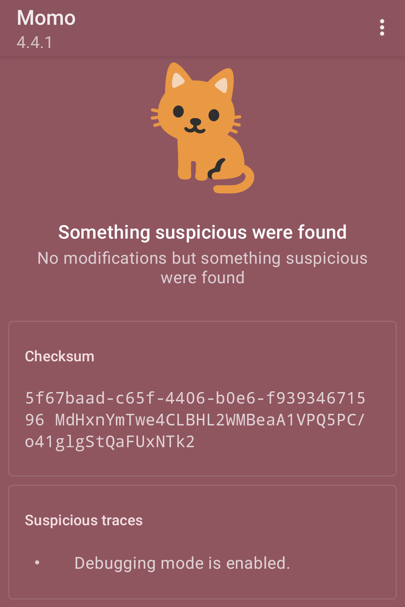

  
Hunter

 

  
Checker

 

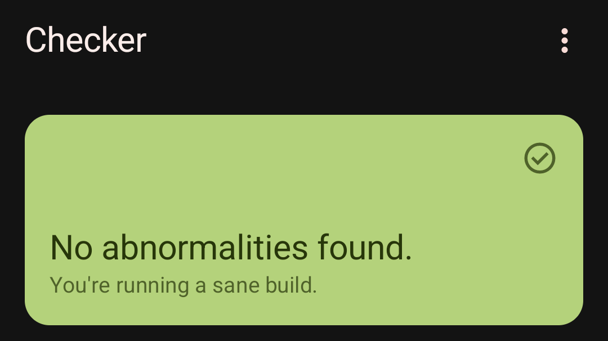

  
Securify

 

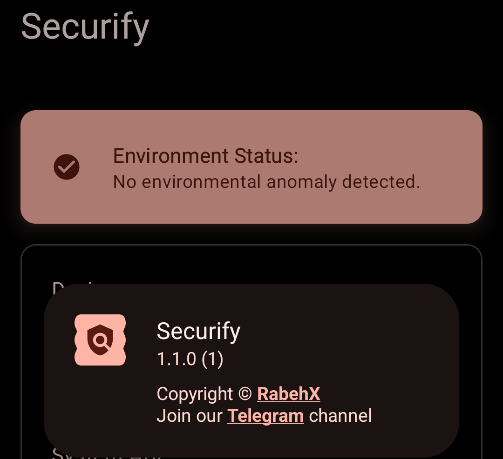

  
Native Test

 

  
TB Checker

 
<ol>

Result Check Root

 

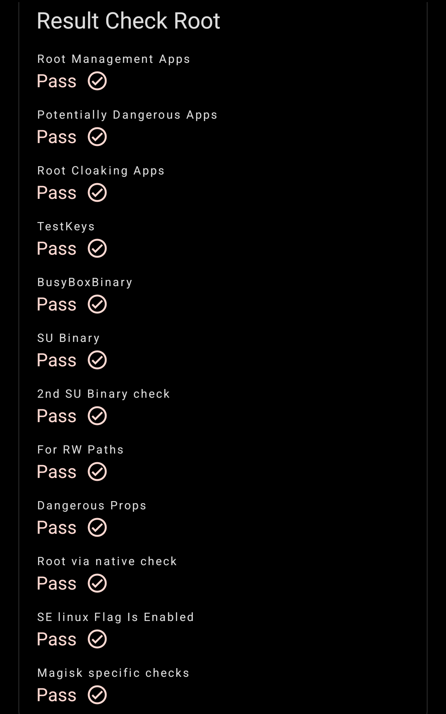

Abnormal Environment

 

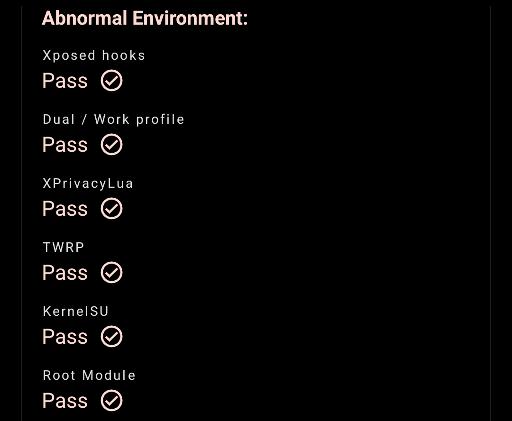

PM Command

 

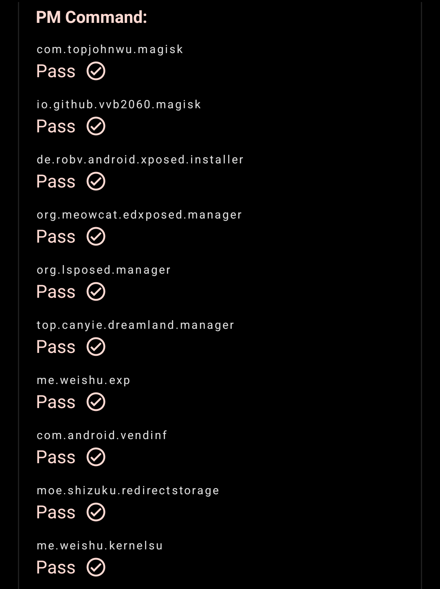

PM Conventional APIs

 

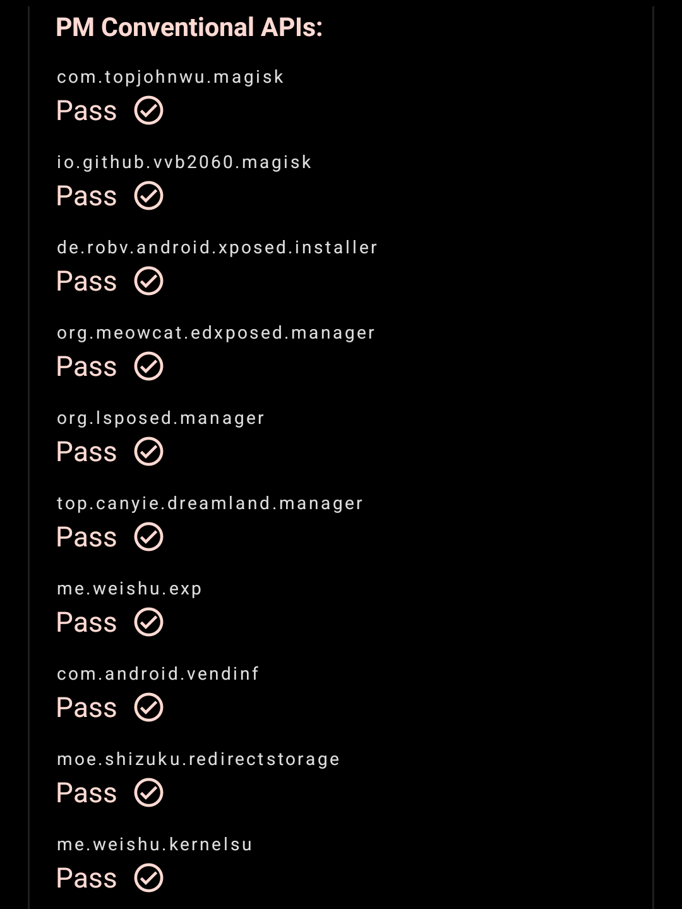

PM Sundry APIs

 

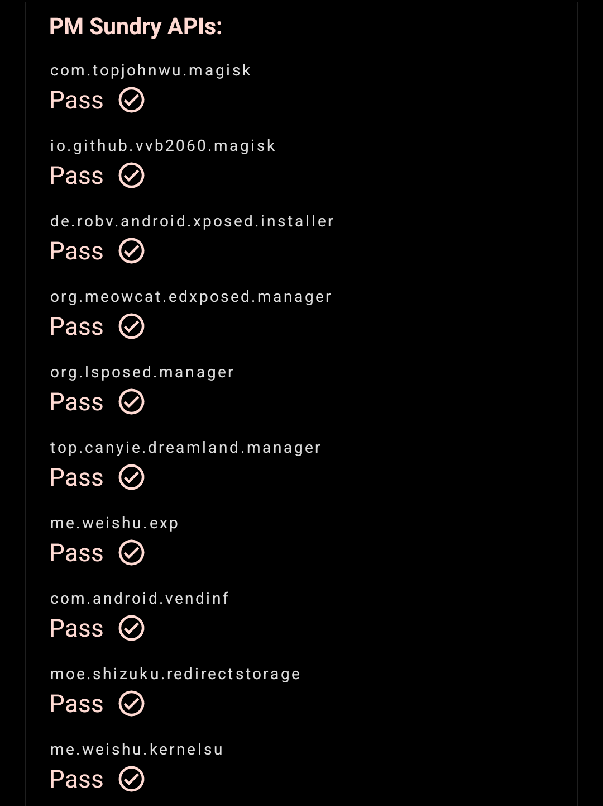

PM Intent Queries

 

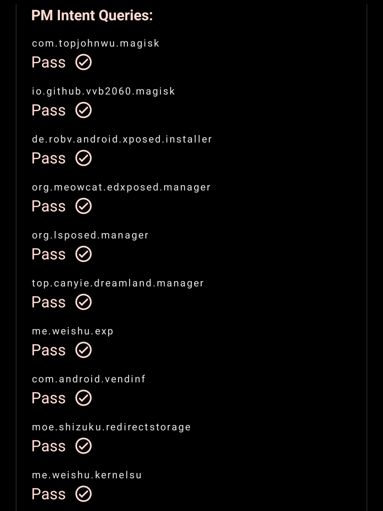

Libc File Detection

 

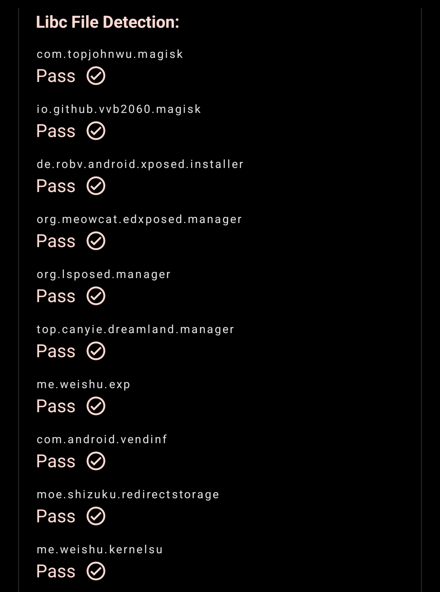

Syscall File Detection

 

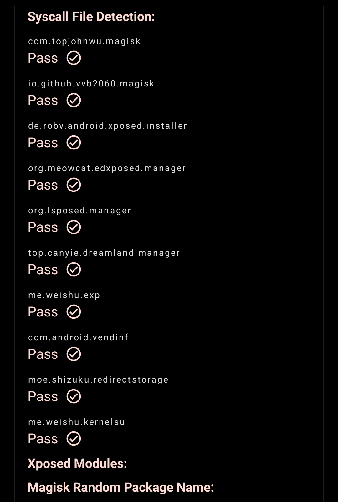

</ol>

  
Native Check

 

  
Key Attestation

 

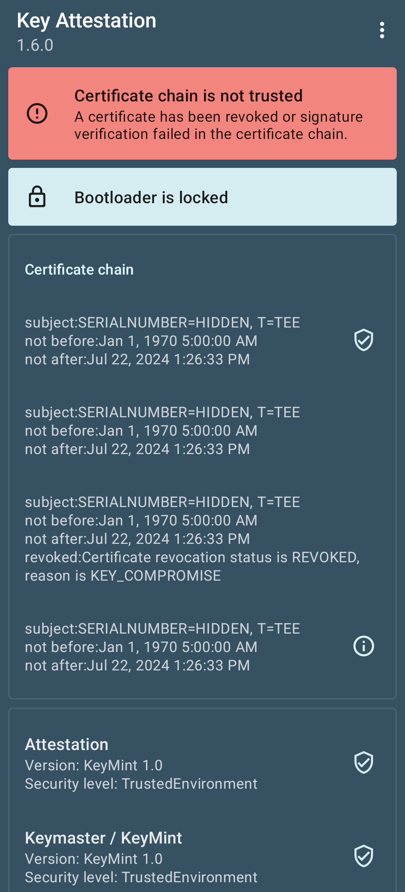

  
Memory Detector

 

