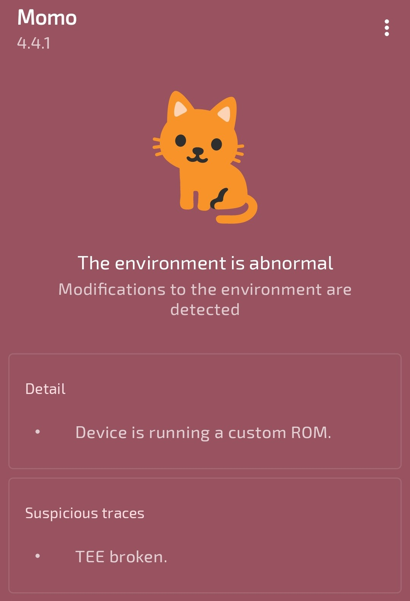

# Mobile Setup

Device : [POCO X3 Pro](https://www.gsmarena.com/xiaomi_poco_x3_pro-10802.php) 
CodeName : Vayu 
Variant : 6/128 
Recovery : [TWRP](https://eu.dl.twrp.me/vayu/twrp-3.7.1_12-0-vayu.img.html) 
Firmware : [v13.0.9.0.SJUMIXM](https://xiaomifirmwareupdater.com/firmware/vayu/stable/V13.0.9.0.SJUMIXM/) 
OS : crDroid-7.39 - [[Mirror 1](https://sourceforge.net/projects/chiteroman/files/crDroid%20v7%20%28A11%29/crDroidAndroid-11.0-20240507-vayu-v7.39.zip/download) , [Mirror 2](https://drive.google.com/file/d/1fEUofBML5ht6Kaogp-RhlN74TewoWsya/view?usp=sharing)] 
Kernel : [AnymoreKSU](https://xdaforums.com/t/anymoreproject-kernel-for-poco-x3-pro.4658138/) 
[LCM](https://play.google.com/store/apps/details?id=ru.andr7e.deviceinfohw) : Huaxing (dsi_j20s_42_02_0b) 
Gapps : [NikGApps R - Core](https://sourceforge.net/projects/nikgapps/files/Releases/NikGapps-R/) 

Gpu Version : Stock (v@0502) 
Refresh Rate : 60Hz 
Browser : [Kiwi](https://play.google.com/store/apps/details?id=com.kiwibrowser.browser) 
Dns : [ControlD](https://controld.com/free-dns) 
Color Profile : Standard [Display Mode : Off] 
Ringtone : [Kudüs Fatihi Selahaddin Eyyubi](https://github.com/ToucH9000/Mobile-Setup/raw/main/Files/O-Kutlu-Zaferin.zip)

Camera : [MGC_8.1.101_A9_GV2b_snap](https://1-dontsharethislink.celsoazevedo.com/file/filesc/MGC_8.1.101_A9_GV2b_snap.apk) 
Config : [ForkBSGx3P-NFv61](https://github.com/BEASTover9000/Mobile-Specification/releases/tag/v61) 

# KernelSU Setup

  
<b>Why KernelSU Is Best?</b>

   
  
1. Module system based on [OverlayFS](https://en.m.wikipedia.org/wiki/OverlayFS).
2. Lock up the root power in a cage through [App Profile](https://kernelsu.org/guide/app-profile.html). 

  
Settings

   
  

  
Modules

   

  1. [Shamiko](https://github.com/LSPosed/LSPosed.github.io/releases)
  2. [Zygisk Next](https://github.com/Dr-TSNG/ZygiskNext/releases)
  3. [LSPosed MOD](https://github.com/pumPCin/LSPosed/actions)

# Detections

**Some detections are common and can't be bypassed, this doesn't mean you can polute the modding environment by crying to a developer to [fix](https://github.com/ToucH9000/PIFvayuLOS/blob/main/Details.md) detection.** [Here's](https://github.com/ToucH9000/Mobile-Setup/blob/main/Files/build.prop) the example of hiding LineageOS properties which is present in system partion (build.prop)

  
Ruru

 

  
Momo

 

  
Hunter

 

  
Native Test

 

  
Native Check

 

  
RootBeer Fresh

 

  
Memory Detector

 

