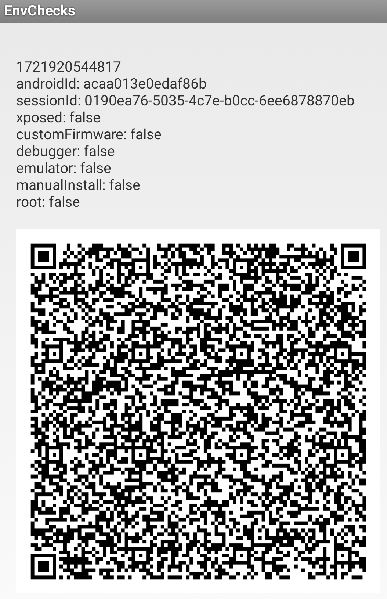

# Mobile Setup

Device : [POCO X3 Pro](https://www.gsmarena.com/xiaomi_poco_x3_pro-10802.php) 
CodeName : Vayu 
Variant : 6/128 
Recovery : [TWRP v3.7.1](https://eu.dl.twrp.me/vayu/twrp-3.7.1_12-0-vayu.img.html) 
Firmware : [v13.0.9.0.SJUMIXM](https://xmfirmwareupdater.com/firmware/vayu/stable/V13.0.9.0.SJUMIXM/) 
OS : [LineageOS 19.1](https://lineage-archive.timschumi.net/build/14772) ([Gdrive](https://drive.google.com/file/d/18c-ezNr0LoxXy3CNQQxY62XLaoL5QYsI/view?usp=sharing)) 
Kernel : Stock ([Kernel Name Changer](https://github.com/ToucH9000/Mobile-Setup/raw/main/Files/Kernel_Name_Changer.zip)) 
[LCM](https://play.google.com/store/apps/details?id=ru.andr7e.deviceinfohw) : Huaxing (dsi_j20s_42_02_0b) 
Gapps : [NikGApps SL - Core](https://sourceforge.net/projects/nikgapps/files/Releases/Android-12.1/) 

Gpu Version : Stock (v@0502) 
Refresh Rate : 60Hz 
Browser : [Kiwi](https://play.google.com/store/apps/details?id=com.kiwibrowser.browser) 
Dns : [Goolag](https://developers.google.com/speed/public-dns/docs/using#change_your_dns_servers_settings) 
Colors : Saturated 
Ringtone : [Kudüs Fatihi Selahaddin Eyyubi](https://github.com/ToucH9000/Mobile-Setup/raw/main/Files/O-Kutlu-Zaferin.zip)

Camera : [MGC_8.1.101_A9_GV2b_snap](https://1-dontsharethislink.celsoazevedo.com/file/filesc/MGC_8.1.101_A9_GV2b_snap.apk) 
Config : [ForkBSGx3P-NFv61](https://github.com/BEASTover9000/Mobile-Specification/releases/tag/v61) 

# Alpha Setup

  
Settings

   
  

  
Modules

   

  1. [Shamiko](https://t.me/LSPosed/278)
  2. [Zygisk Next](https://github.com/Dr-TSNG/ZygiskNext/releases/latest)
  3. [HIDEpropLOS](https://github.com/ToucH9000/Mobile-Setup/raw/main/Files/HIDEpropLOS.zip)
  4. [LSPosed MOD](https://github.com/pumPCin/LSPosed_mod/actions)
  5. [Tricky Store](https://github.com/5ec1cff/TrickyStore/actions?query=branch%3Amaster) ([target.txt](https://github.com/ToucH9000/Mobile-Setup/blob/main/Files/target.txt))

  
LSPosed Modules

   

  1. [Installer Plus](https://github.com/NextAlone/InstallerPlus/releases/latest)
  2. [Hide My Applist](https://github.com/Dr-TSNG/Hide-My-Applist/releases/latest)
  3. [Enable Screenshot](https://github.com/Xposed-Modules-Repo/io.github.lsposed.disableflagsecure/releases/latest)
  4. [Pixelify Google Photos](https://github.com/BaltiApps/Pixelify-Google-Photos/releases/latest)
  5. [X Call Recording Settings](https://github.com/iptux/XCallRecording-xposed/releases/latest)

# Detections

**Some detections are common and can't be bypassed, this doesn't mean you can polute the modding environment by crying to a developer to [fix](https://github.com/ToucH9000/PIFvayuLOS/blob/main/Details.md) detection.** [Here's](https://github.com/ToucH9000/Mobile-Setup/blob/main/Files/LOSbuild.prop) the example of hiding LineageOS properties which is present in system partion (build.prop)

  
Ruru

 

  
Hunter

 

  
EnvChecks

 

  
Native Test

 

  
Native Check

 

  
Key Attestation

 

  
Memory Detector

 

