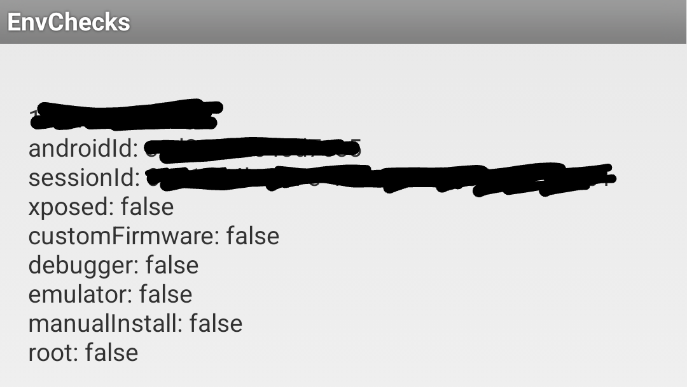
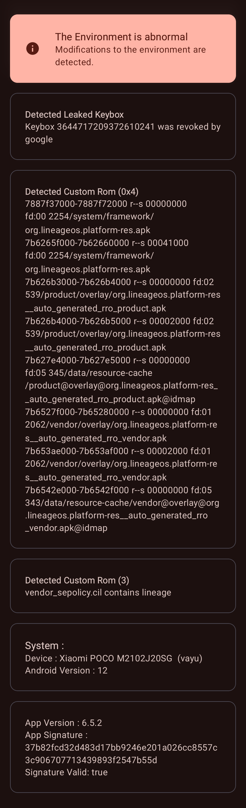

# Mobile Setup

Device : [POCO X3 Pro](https://www.gsmarena.com/xiaomi_poco_x3_pro-10802.php) 
CodeName : Vayu 
Variant : 6/128 
Recovery : [TWRP v3.7.1](https://eu.dl.twrp.me/vayu/twrp-3.7.1_12-0-vayu.img.html) 
Firmware : [v13.0.9.0.SJUMIXM](http://xmfirmwareupdater.com/firmware/vayu/stable/V13.0.9.0.SJUMIXM/) 
OS : [LineageOS 19.1](https://lineage-archive.timschumi.net/build/14772) 
Kernel : [NeoPRRF-SusFS](https://github.com/ToucH9000/Mobile-Setup/raw/refs/heads/main/Files/NeoPERF-SusFS.zip) 
[LCM](https://play.google.com/store/apps/details?id=ru.andr7e.deviceinfohw) : Huaxing (dsi_j20s_42_02_0b) 

Gpu Version : Stock (v@0502) 
Refresh Rate : 60Hz 
DNS : [dns.sb](https://dns.sb/) 
Browser : [IceRaven](https://github.com/fork-maintainers/iceraven-browser) 
Colors : Saturated 
Ringtone : [Kudüs Fatihi Selahaddin Eyyubi](https://github.com/ToucH9000/Mobile-Setup/raw/main/Files/O-Kutlu-Zaferin.zip)

Camera : [MGC_8.1.101_A9_GV2b_snap](https://1-dontsharethislink.celsoazevedo.com/file/filesc/MGC_8.1.101_A9_GV2b_snap.apk) 
Config : [ForkBSGx3P-NFv61](https://github.com/BEASTover9000/Mobile-Specification/releases/tag/v61) 

# KernelSU Setup

  
Settings

   
  

  
Modules

   

  1. [Shamiko](https://t.me/LSPosed/278)
  2. [SusFS Next](https://github.com/ToucH9000/Mobile-Setup/raw/refs/heads/main/Files/SusFS-Next-v1.4.1.zip)
  3. [Zygisk Next](https://github.com/Dr-TSNG/ZygiskNext/releases/tag/v1.2.0-Preview2)
  4. [LSPosed npm](https://t.me/rormzhstjxm)
  5. [Tricky Store](https://github.com/5ec1cff/TrickyStore/releases/tag/1.2.0)

# Detections

**Some detections are common and can't be bypassed, this doesn't mean you can polute the modding environment by crying to a developer to [fix](https://github.com/ToucH9000/PIFvayuLOS/blob/main/Details.md) detection.**

  
Ruru

 

  
Hunter

 

  
EnvChecks

 

  
Native Test

 

  
Native Check

 

