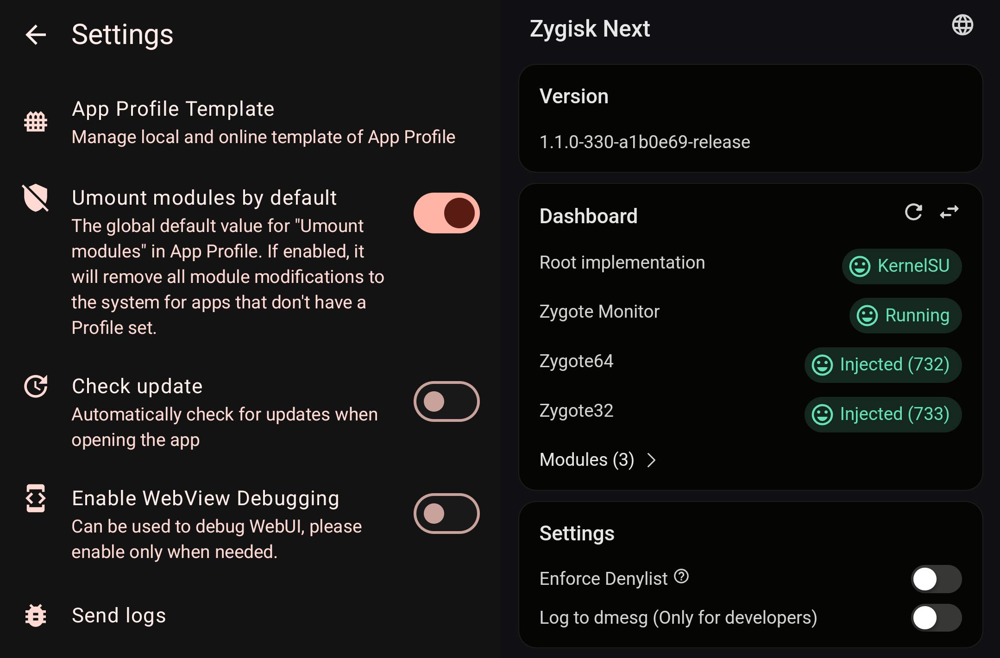

# Mobile Setup (WIP)

Device : [POCO X3 Pro](https://www.gsmarena.com/xiaomi_poco_x3_pro-10802.php) 
CodeName : Vayu 
Variant : 6/128 
Recovery : [TWRP v3.6.2](https://eu.dl.twrp.me/vayu/twrp-3.6.2_11-0-vayu.img.html) 
Firmware : [v12.5.9.0.RJUMIXM](https://xmfirmwareupdater.com/firmware/vayu/stable/V12.5.9.0.RJUMIXM/) 
OS : [LineageOS 18.1](https://lineage-archive.timschumi.net/build/903) ([Gdrive](https://drive.google.com/file/d/1YFiPs7f1kBc1XUgK8zQP-3SnNEJAXzcr/view?usp=sharing)) 
Kernel : [NeoSTOCK](https://github.com/ToucH9000/Mobile-Setup/raw/main/Files/NeoSTOCK.zip) ([Eva GCC v15](https://github.com/mvaisakh/gcc-build)) 
[LCM](https://play.google.com/store/apps/details?id=ru.andr7e.deviceinfohw) : Huaxing (dsi_j20s_42_02_0b) 
Gapps : [NikGApps R - Core](https://sourceforge.net/projects/nikgapps/files/Releases/NikGapps-R/) 

Gpu Version : Stock (v@0502) 
Refresh Rate : 60Hz 
Browser : [Kiwi](https://play.google.com/store/apps/details?id=com.kiwibrowser.browser) 
Dns : [ControlD](https://controld.com/free-dns) 
Color Profile : None 
Ringtone : [Kudüs Fatihi Selahaddin Eyyubi](https://github.com/ToucH9000/Mobile-Setup/raw/main/Files/O-Kutlu-Zaferin.zip)

Camera : [MGC_8.1.101_A9_GV2b_snap](https://1-dontsharethislink.celsoazevedo.com/file/filesc/MGC_8.1.101_A9_GV2b_snap.apk) 
Config : [ForkBSGx3P-NFv61](https://github.com/BEASTover9000/Mobile-Specification/releases/tag/v61) 

# KernelSU Setup

  
Settings

   
  

  
Modules

   

  1. [Shamiko](https://github.com/LSPosed/LSPosed.github.io/releases/latest)
  2. [Zygisk Next](https://github.com/Dr-TSNG/ZygiskNext/releases/latest)
  3. [LSPosed MOD](https://github.com/pumPCin/LSPosed/actions)
  4. [Tricky Store](https://github.com/5ec1cff/TrickyStore/actions?query=branch%3Amaster)

  
LSPosed Modules

   

  1. [Installer Plus](https://github.com/NextAlone/InstallerPlus/releases/latest) (Package Installer Mod)
  2. [Hide My Applist](https://github.com/Dr-TSNG/Hide-My-Applist/releases/latest) (Hide APK Traces)
  3. [Enable Screenshot](https://github.com/Xposed-Modules-Repo/io.github.lsposed.disableflagsecure/releases/latest) (Kill Screenshot Restriction)
  4. [Pixelify Google Photos](https://github.com/BaltiApps/Pixelify-Google-Photos/releases/latest) (Unlimited Google Photos)
  5. [X Call Recording Settings](https://github.com/iptux/XCallRecording-xposed/releases/latest) (Kill Region Restriction)

# Detections

**Some detections are common and can't be bypassed, this doesn't mean you can polute the modding environment by crying to a developer to [fix](https://github.com/ToucH9000/PIFvayuLOS/blob/main/Details.md) detection.** [Here's](https://github.com/ToucH9000/Mobile-Setup/blob/main/Files/LOSbuild.prop) the example of hiding LineageOS properties which is present in system partion (build.prop)

  
Ruru

 

  
Hunter

 

  
Native Test

 

  
Native Check

 

  
Memory Detector

 

