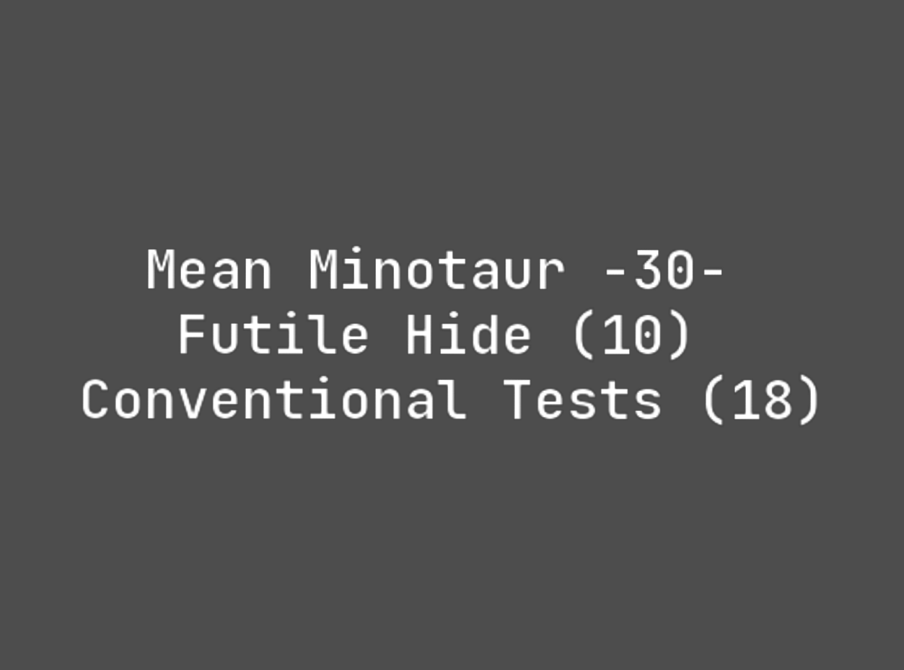

# Mobile Setup

Device : [POCO X3 Pro](https://www.gsmarena.com/xiaomi_poco_x3_pro-10802.php) 
CodeName : Vayu 
Variant : 6/128 
Recovery : [OrangeFox](https://orangefox.download/device/vayu) 
Firmware : [v14.0.3.0.TJUMIXM](https://xiaomifirmwareupdater.com/firmware/vayu/stable/V14.0.3.0.TJUMIXM/) 
OS : [crDroid 10](https://sourceforge.net/projects/crdroid/files/vayu/10.x/) 
Kernel : [PerryRiceKSU](https://t.me/PerryTheKernelCL) 
Gapps : [NikGApps U - Core](https://sourceforge.net/projects/nikgapps/files/Releases/NikGapps-U/) 

Gpu Version : v@0530 - crD Default 
Browser : [Kiwi](https://play.google.com/store/apps/details?id=com.kiwibrowser.browser) 
WebView : [By LineageOS](https://www.apkmirror.com/apk/lineageos/android-system-webview-2/) 

Camera : [MGC_8.1.101_A9_GV2b_snap](https://1-dontsharethislink.celsoazevedo.com/file/filesc/MGC_8.1.101_A9_GV2b_snap.apk) 
Config : [ForkBSGx3P-NFv61](https://github.com/BEASTover9000/Mobile-Specification/releases/tag/v61) 

Rooted With [KernelSU](https://github.com/tiann/KernelSU)

# KernelSU Setup

[Zygisk-NEXT](https://github.com/Dr-TSNG/ZygiskNext) + [Shamiko](https://github.com/LSPosed/LSPosed.github.io/releases) + [LSPosed (No Log)](https://github.com/pumPCin/LSPosed) + [HIDEpropCRD](https://github.com/ToucH9000/Mobile-Setup/raw/main/HIDEpropCRD.zip)

# Detections

**Some detections are comman and can't be bypassed, this doesn't mean you can polute the modding environment by crying to a developer to fix detection**

  
Hunter

 
  

  
Securify

 
  

  
Checker

 
  

  
Native Test

 
  

  
Native Check

 
  

  
Memory Detector

 
  

